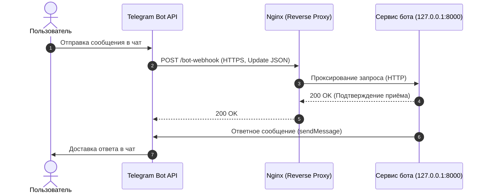

# Telegram Bot API: Webhook & OpenAPI

Добро пожаловать в проект по настройке и интеграции **Webhook** для **Telegram Bot API** с использованием обратного прокси **Nginx** и спецификации **OpenAPI 3.0**.

---

## Архитектура взаимодействия

При работе в режиме Webhook серверы Telegram самостоятельно доставляют входящие события (сообщения, нажатия inline-кнопок) по протоколу HTTPS на ваш веб-сервер. Nginx принимает защищённое соединение (SSL-терминация) и перенаправляет запрос в локальный сервис бота.

---

## Разделы документации

-   :material-server-network:{ .lg .middle } __[Настройка Webhook](webhook.md)__

    ---

    Пошаговое руководство по развёртыванию обратного прокси Nginx, выпуску SSL-сертификатов, регистрации вебхука в Telegram Bot API и устранению неполадок (Troubleshooting).

    [:octicons-arrow-right-24: Перейти к руководству](webhook.md)

-   :material-api:{ .lg .middle } __[Спецификация OpenAPI](openapi.md)__

    ---

    Описание схемы API (OpenAPI 3.0.3) для метода `setWebhook`, поддержка отправки сертификатов (`multipart/form-data`) и структура событий `Update`.

    [:octicons-arrow-right-24: Открыть спецификацию](openapi.md)

