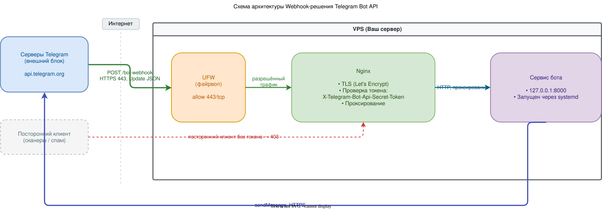
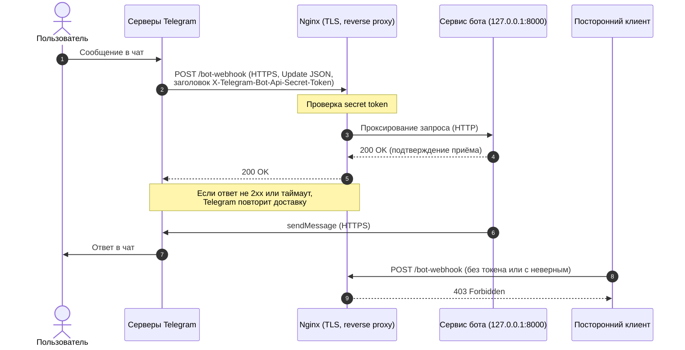

# Настройка webhook Telegram Bot API через Nginx: руководство и OpenAPI-спецификация

Документация по безопасной интеграции вебхуков **Telegram Bot API** через обратный прокси **Nginx**: пошаговая настройка серверной инфраструктуры, валидация входящего трафика и интерактивная спецификация **OpenAPI 3.0**.

---

## Схема архитектуры

> Исходный файл схемы для редактирования: [`architecture.drawio`](assets/architecture.drawio).

## Диаграмма последовательности (Sequence Diagram)

```mermaid
sequenceDiagram
    autonumber
    actor User as Пользователь
    participant TG as Серверы Telegram
    participant Nginx as Nginx (TLS, reverse proxy)
    participant Bot as Сервис бота (127.0.0.1:8000)
    participant Ext as Посторонний клиент

    User->>TG: Сообщение в чат
    TG->>Nginx: POST /bot-webhook (HTTPS, Update JSON,<br/>заголовок X-Telegram-Bot-Api-Secret-Token)
    Note over Nginx: Проверка secret token
    Nginx->>Bot: Проксирование запроса (HTTP)
    Bot-->>Nginx: 200 OK (подтверждение приёма)
    Nginx-->>TG: 200 OK
    Note over TG,Nginx: Если ответ не 2xx или таймаут,<br/>Telegram повторит доставку
    Bot->>TG: sendMessage (HTTPS)
    TG->>User: Ответ в чат

    Ext->>Nginx: POST /bot-webhook (без токена или с неверным)
    Nginx-->>Ext: 403 Forbidden
```

---

## Разделы документации

-   :material-server-network:{ .lg .middle } __[Настройка Webhook](webhook.md)__

    ---

    Пошаговое руководство по настройке обратного прокси Nginx, работе с SSL/TLS-сертификатами (Let's Encrypt и Self-Signed), регистрации вебхука в Telegram Bot API и устранению неполадок (Troubleshooting).

    [:octicons-arrow-right-24: Перейти к руководству](webhook.md)

-   :material-api:{ .lg .middle } __[Спецификация OpenAPI](openapi.md)__

    ---

    Описание схемы API (OpenAPI 3.0) для методов управления вебхуком (`setWebhook`, `getWebhookInfo`, `deleteWebhook`), поддержка отправки сертификатов (`multipart/form-data`) и структура входящих событий `Update` и `CallbackQuery`.

    [:octicons-arrow-right-24: Открыть спецификацию](openapi.md)

-   :material-book-open-page-variant:{ .lg .middle } __[Глоссарий](glossary.md)__

    ---

    Глоссарий терминов и понятий, используемых в проекте, включая сетевую инфраструктуру, работу с Nginx, SSL/TLS-сертификаты и API-контракты.

    [:octicons-arrow-right-24: Перейти к глоссарию](glossary.md)

