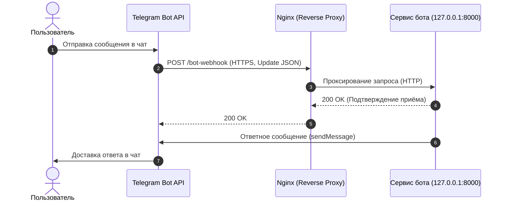

# Telegram Webhook via Nginx: руководство и OpenAPI-спецификация

Добро пожаловать в руководство по безопасной интеграции **Webhook** для **Telegram Bot API** с использованием обратного прокси **Nginx** и спецификации **OpenAPI 3.0**.

---

## Архитектура взаимодействия

При работе в режиме Webhook серверы Telegram самостоятельно доставляют входящие события (сообщения, нажатия inline-кнопок) по протоколу HTTPS на ваш веб-сервер. Nginx принимает защищённое соединение (SSL-терминация) и перенаправляет запрос в локальный сервис бота.

```mermaid
sequenceDiagram
    autonumber
    actor User as Пользователь
    participant TG as Telegram Bot API
    participant Nginx as Nginx (Reverse Proxy)
    participant Bot as Сервис бота (127.0.0.1:8000)

    User->>TG: Отправка сообщения в чат
    TG->>Nginx: POST /bot-webhook (HTTPS, Update JSON)
    Nginx->>Bot: Проксирование запроса (HTTP)
    Bot-->>Nginx: 200 OK (Подтверждение приёма)
    Nginx-->>TG: 200 OK
    Bot->>TG: Ответное сообщение (sendMessage)
    TG->>User: Доставка ответа в чат
```

---

## Разделы документации

-   :material-server-network:{ .lg .middle } __[Настройка Webhook](webhook.md)__

    ---

    Пошаговое руководство по настройке обратного прокси Nginx, работе с SSL/TLS-сертификатами (Let's Encrypt и Self-Signed), регистрации вебхука в Telegram Bot API и устранению неполадок (Troubleshooting).

    [:octicons-arrow-right-24: Перейти к руководству](webhook.md)

-   :material-api:{ .lg .middle } __[Спецификация OpenAPI](openapi.md)__

    ---

    Описание схемы API (OpenAPI 3.0.3) для методов управления вебхуком (`setWebhook`, `getWebhookInfo`, `deleteWebhook`), поддержка отправки сертификатов (`multipart/form-data`) и структура входящих событий `Update` и `CallbackQuery`.

    [:octicons-arrow-right-24: Открыть спецификацию](openapi.md)

